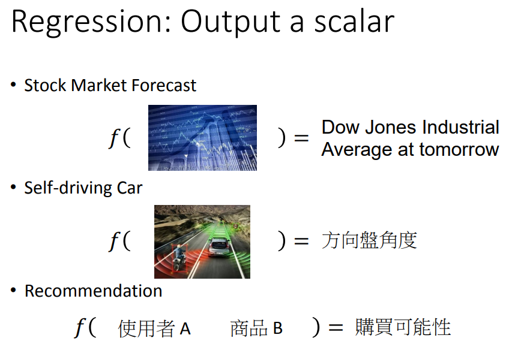
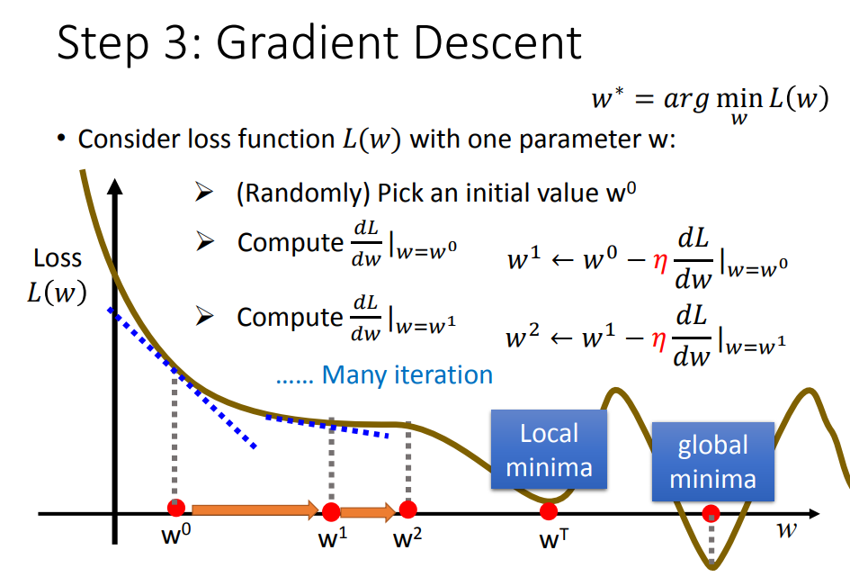
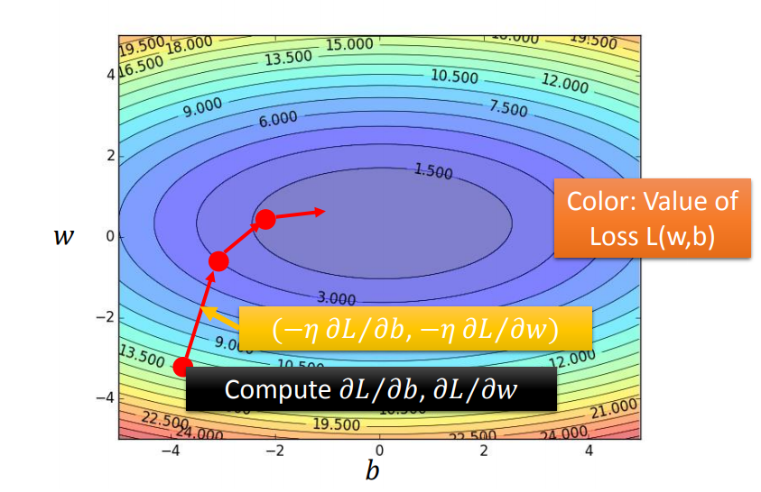
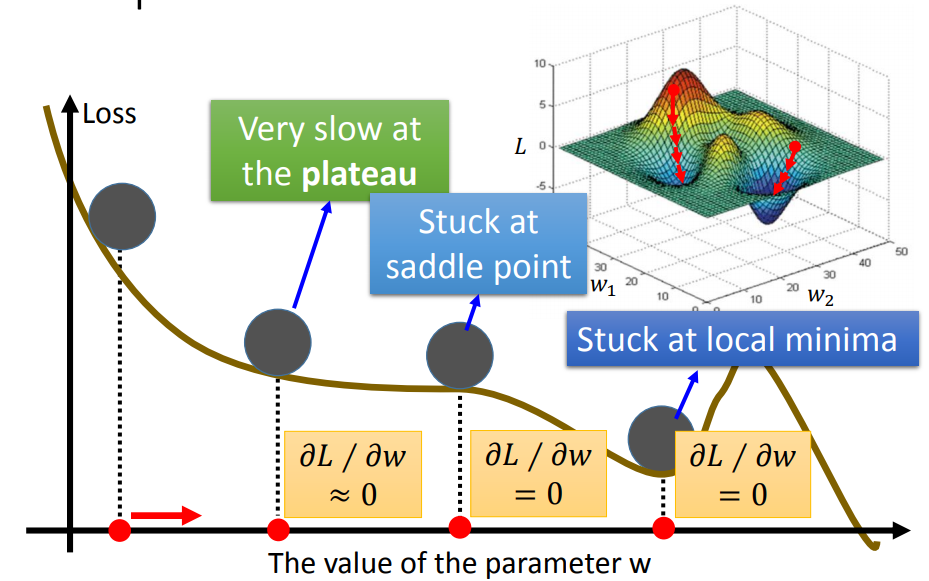
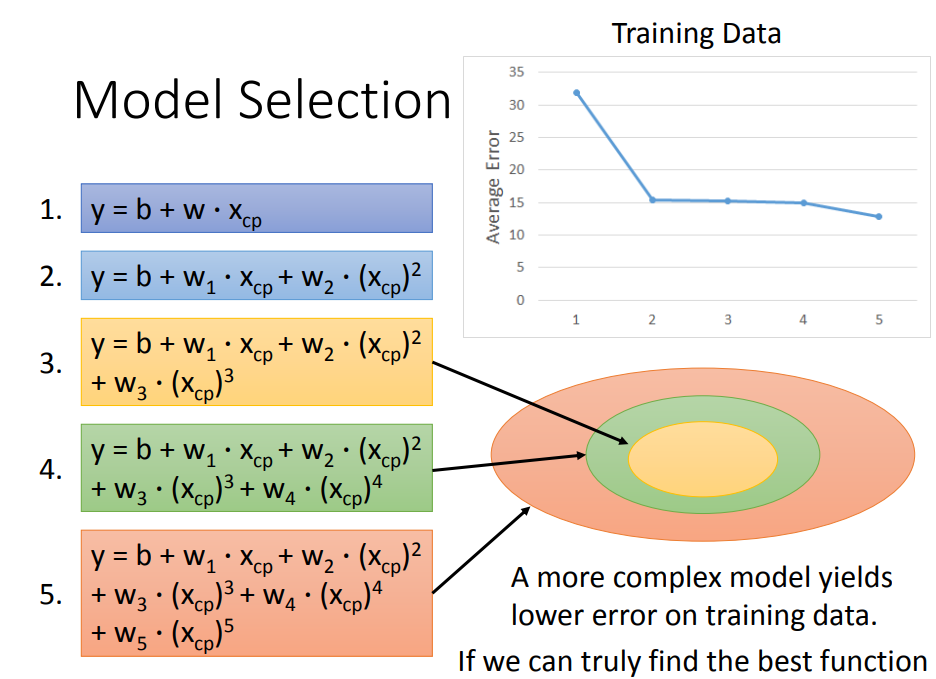
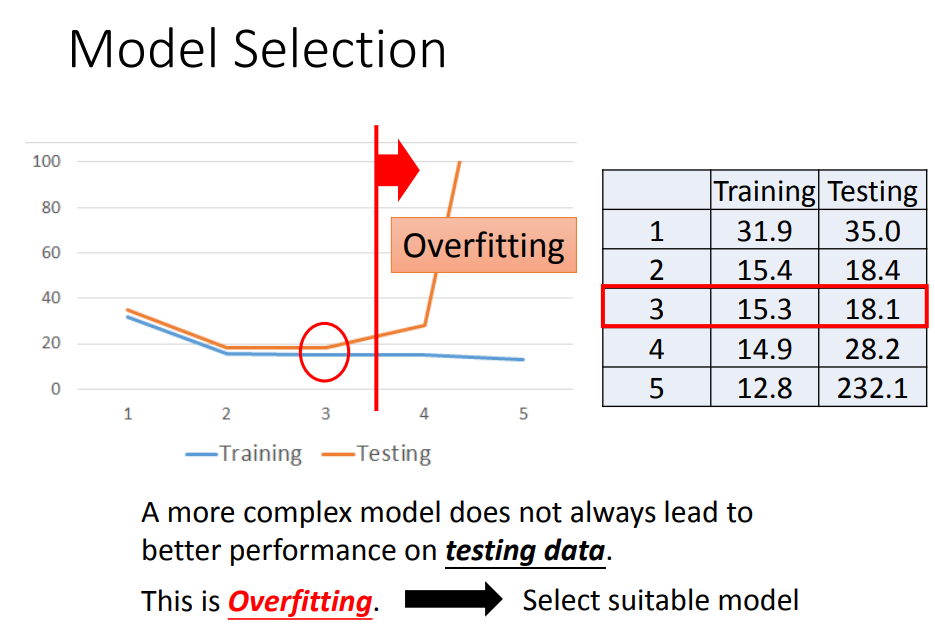
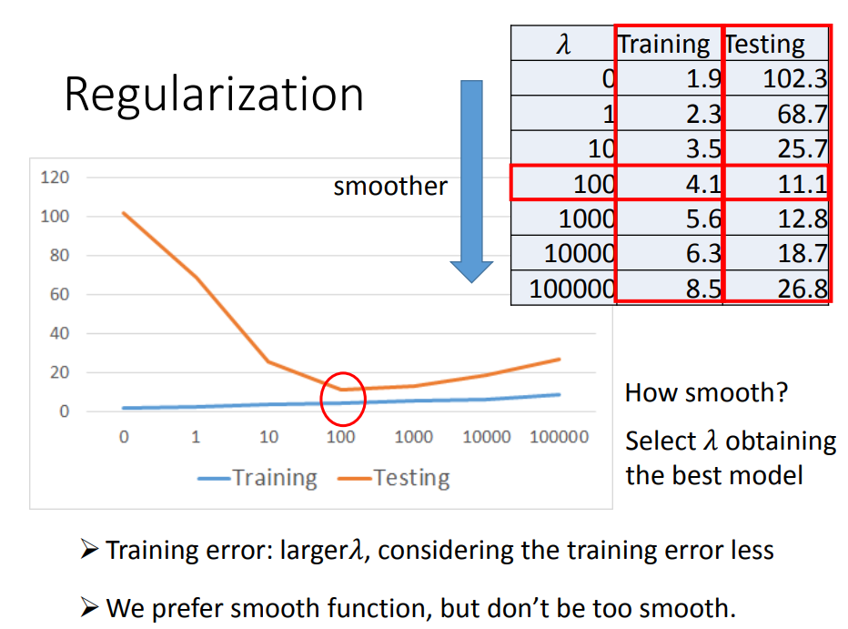

# regression
（相关博客笔记https://blog.csdn.net/herosunly/article/details/88110338）
输出是一个scalar数值

## 第一步：模型model
假设考虑线性模型

linear model:表达式：
$y=b+\sum w_{i} x_{i}$

b: bias, w: weight, $\mathcal{X}_{i}$: feature

w, b值很多，会有很多可选的function；有很多影响y的x

## 第二步：判断模型好坏goodness of function

* input: training data: $\left(x^{1}, \hat{y}^{1}\right)$, $\left(x^{2}, \hat{y}^{2}\right)$,……, $\left(x^{10}, \hat{y}^{10}\right)$
* output: scalar
### Loss fuction L: 损失函数
衡量function好坏

* input: 一个function
* output: 好坏

$L(f)=L(w, b)=\sum_{n=1}^{10}\left(\hat{y}^{n}-\left(b+w \cdot x_{c p}^{n}\right)\right)^{2}$

$\hat{y}^{n}$是真实值，$f\left(x_{c p}^{n}\right)$（也就是后者）是预测值，公式是对每个样本的误差求平方和

## 第三步：best function最优函数

将求最优函数问题问题转化成最优化问题

要找出使得L最小的f，找出w, b：

$f^{*}=\arg \min _{f} L(f)$

$w^{*}, b^{*}=\arg \min _{w, b} L(w, b)=\arg \min _{w, b} \sum_{n=1}^{10}\left(\hat{y}^{n}-\left(b+w \cdot x_{c p}^{n}\right)\right)^{2}$

求解方法：

* 一种是解析解（只有线性可用）
* 梯度下降（课程重点）

## 梯度下降

### 一个参数

1、假设画L(w)关于一个参数w的曲线，随机取一点$\mathrm{w}^{0}$

2、计算$\left.\frac{d L}{d w}\right|_{W=w^{0}}$，也就是当前斜率
* 斜率为负：增加w（才能使L变小）
* 斜率为正：减小w

通过计算可得下一个w：$w^{1} \leftarrow w^{0}-\eta\left.\frac{d L}{d w}\right|_{w=w^{0}}$

$\eta$是学习率

3、计算下一个斜率（微分）直到微分为零，无法移动。这可能会导致得到局部最优，而不是全局最优。

### 两个参数
$w^{*}, b^{*}=\arg \min _{w, b} L(w, b)$

1、随机选取$w^{0}, b^{0}$

2、计算$\left.\frac{\partial L}{\partial w}\right|_{w=w^{0}, b=b^{0}},\left.\frac{\partial L}{\partial b}\right|_{w=w^{0}, b=b^{0}}$

根据偏微分的结果，$w^{1} \leftarrow w^{0}-\eta\left.\frac{\partial L}{\partial w}\right|_{w=w^{0}, b=b^{0}}$

$b^{1} \leftarrow b^{0}-\eta\left.\frac{\partial L}{\partial b}\right|_{w=w^{0}, b=b^{0}}$

3、继续计算直到……

也可用向量$\nabla L=\left[ \begin{array}{c}{\frac{\partial L}{\partial w}} \\ {\frac{\partial L}{\partial b}}\end{array}\right]$ gradient表示

可以说：梯度下降是找最快下山的方法

### 梯度下降的问题

一个假设并不是始终正确的：随着参数的值的更新，损失函数会越来越小，直到找到损失函数的最小值

* 因为微分为零，被困在局部最优
* 因为微分为零，停在鞍点（saddle point），不是极值的点

而常常是微分小于阈值，就被认为靠近。这并不一定是正确的

若函数是凸函数，则不用考虑

### 是否存在更好的函数？模型选择

* 线性函数-多项式函数来降低数据误差

model的线性与否取决于参数（w，b）是不是线性，而不是特征（x）的线性与否

* 依次用一次 二次 三次 四次 五次函数去尝试描述

* 当五次函数时，虽然训练误差小，但测试误差大，称为过拟合（训练误差与测试误差相差过大）

* 原因：在训练过程中，模型越来越复杂时，error越小，因为多次的函数包含小的次的函数（例：三次函数包含二次函数）

而在测试过程中，则不然，称为过拟合（overfitting）

如何解决过拟合？

* 收集更多的数据
* 发现某些隐藏的因素在影响结果
* 需要重新设计模型

【这里有点不透彻】

## 正则化

$L=\sum_{n}\left(\hat{y}^{n}-\left(b+\sum w_{i} x_{i}\right)\right)^{2}+\lambda \sum\left(w_{i}\right)^{2}$

加号后面是：找到使w参数很小的函数（也就是平滑的函数）
$\lambda$取值越大，函数越平滑；表示惩罚项

那为什么函数w越小，函数就越平滑呢。因为当x变了一个$x+\Delta x$（一个很小的变化量）的时候，整体的$y=w * x+b$不会变化太大，所以得到的值也更加准确

为什么函数要平滑？我们相信越平滑越可能正确

为什么没有考虑bias？bias不影响函数平滑与否，它本身只是一条线，只是对曲线进行了平移

如图，$\lambda$取值越大，training error越大，并不代表testing error也变大。选出最好的$\lambda$使得model最好【此处不解】

